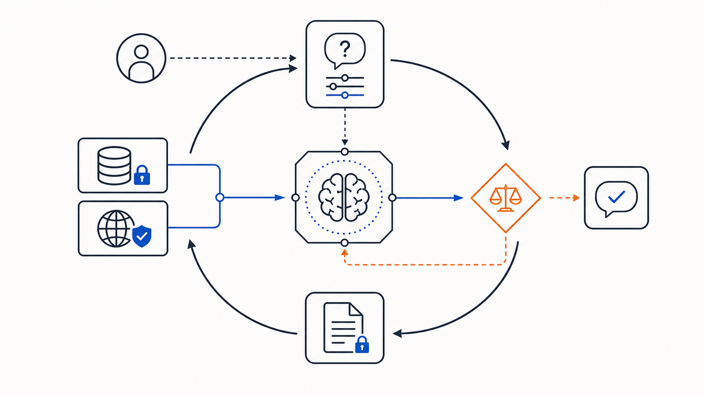
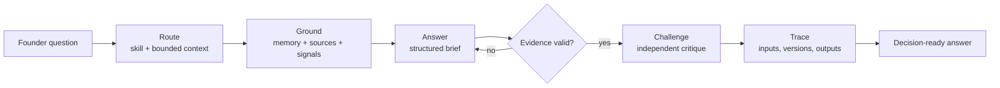
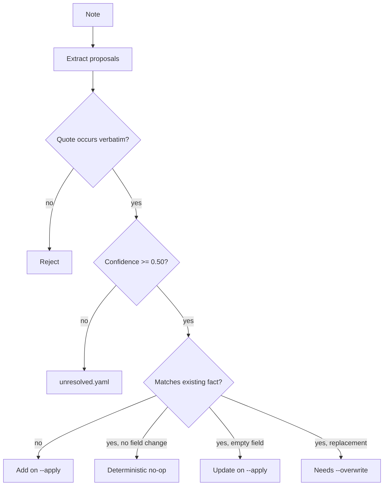

# FounderOS

**An evidence-driven decision system for founders who would rather be corrected than comforted.**

Most AI advice is polished pattern-matching: it cannot show which company fact it used, whether a quote is real, or where its recommendation breaks. FounderOS treats a founder-facing LLM system like an engineering system: explicit inputs, constrained procedures, adversarial review, and an execution trace.

> **Product hypothesis:** FounderOS should improve a founder's judgment compared with giving the same model the same company context in one prompt.

That is a testable claim, not a slogan. The repository includes a `context-dump` control arm, a mechanism-by-mechanism ablation ladder, frozen fixtures, recorded runs, and a deletion rule: if a layer does not earn its cost in evaluation, it is baggage.



### Evidence snapshot

| 9 versioned skills | 2 expert packs / 16 principles | 12 mechanically verified quotations | 5 frozen startup workspaces | 127 offline tests |
| --- | --- | --- | --- | --- |

These are repository facts, not outcome metrics. The project does **not** claim that its recommendations outperform a frontier model until the blinded evaluation suite has been funded and run.



## Why this is a serious project

FounderOS treats model output as an untrusted boundary, not a product primitive.

| Property | Concrete mechanism |
| --- | --- |
| **Company context is auditable** | Private startup memory is typed YAML and Markdown. The selected subset is hashed and saved with every run. |
| **Advice follows a procedure** | Nine versioned skills declare required context, output schema, source vocabulary, and failure modes. |
| **Source claims have receipts** | Every principle marked as a quote is located in the fetched corpus during `pnpm verify`. |
| **A confident draft is not final** | A separate challenger critiques the draft and can revise it; an unsourced revision is discarded. |
| **Paid inference becomes test input** | Raw responses in a trace can be saved as fixtures and replayed end to end without credentials. |
| **Missing infrastructure degrades honestly** | No API key or unavailable corpus yields a useful, labelled offline brief — never simulated model synthesis. |

This is not multi-agent theatre. The default pipeline is deliberately small: route, reason, challenge. Each stage is a measurable intervention that can be removed, replayed, and evaluated.

## The engineering, up close

### Provider weirdness is quarantined at the boundary

Structured output fails in ways normal applications rarely see: a valid object wrapped in `{"body": ...}`, an enum double-encoded as JSON, or a response that is semantically correct but rejected by the SDK schema parser. FounderOS normalizes those observed deformations at the provider boundary rather than leaking provider-specific workarounds across the product.

```text
provider response
      │
      ├─ schema parses ──────────────────────────────► use it
      └─ schema mismatch
            │
            ├─ unwrap a single-key envelope (depth ≤ 2)
            ├─ decode only valid JSON string literals
            ├─ validate again against the exact Zod schema
            └─ retry once with a precise format nudge
```

[`src/provider.ts`](src/provider.ts) preserves ordinary prose, salvages only schema-valid data, and does not retry auth, billing, or rate-limit errors. It keeps the rest of the system provider-agnostic while handling the failures that actually occurred in production-like runs.

### AI-assisted ingestion has a quote gate, not blind writes

`context ingest` creates a deterministic merge plan before writing private startup memory. Nothing is written without `--apply`; a proposed fact needs a verbatim source span; low-confidence items are kept as unresolved; replacing founder-authored values requires `--overwrite`.



Every applied entity carries provenance: source, source type, import date, and original quote. The planner is pure, so the same note and workspace produce the same merge plan — a pragmatic way to test an LLM-shaped workflow without paying for an LLM on every test.

### Citations are build artifacts, not decoration

The knowledge layer keeps private company memory separate from shared source-grounded material. It uses PostgreSQL + pgvector when available, lexical retrieval when embeddings are absent, and reciprocal-rank fusion when both are available. More importantly, a quotation has to survive local verification against the corpus before it is trusted.

```text
source manifest + SHA-256
           │
           ▼
fetched source text ──► contiguous chunks ──► claims / principles
           │                                      │
           └──── quote lookup during verify ◄─────┘
                                                  │
question + skill vocabulary ──► retrieval ──► citable passage IDs
```

The repository distinguishes verified quotations from paraphrases whose original source has not yet been established. A missing source is a visible limit, not an invitation to manufacture authority.

### Answers can be replayed and challenged

Every run records the selected context hash, skill and expert versions, corpus passage IDs, prompts, raw model outputs, timings, and final result. A paid run can become a zero-cost regression fixture. Replay validates routing, context selection, citations, challenger handoff, tracing, and rendering without provider credentials.

The challenger receives the context and the draft, but not the reasoning chain that generated it. If its revision cites support that was never retrieved, FounderOS keeps the already-validated draft rather than shipping an impressive-sounding fabrication.

### Failure-first, not happy-path-only

| Failure | System response | What it refuses to do |
| --- | --- | --- |
| Malformed structured output | Normalizes known wrappers, validates again, then retries once | Guess a shape from arbitrary prose |
| Invented citation or basis | Returns validation errors to the reasoner; rejects a bad challenger revision | Present unsupported authority as evidence |
| Corpus or embedding service unavailable | Continues with labelled degraded retrieval | Claim semantic grounding happened |
| Low-confidence imported fact | Preserves it in `unresolved.yaml` | Merge it into founder memory |
| Conflict with a founder-authored value | Requires `--overwrite` | Silently rewrite the source of truth |
| Missing credentials | Produces an offline brief and an exact repair command | Pretend the full reasoning pass ran |

## The evaluation is part of the product

The architecture is not assumed to create value. The project is designed to test which layer, if any, produces a better answer.


Comparisons are blind and position-randomized. A win over `context-dump` is attributed only to a closed mechanism: context selection, procedure, expert knowledge, challenger, provenance, action structure, or decision memory. A win over an empty chat is not evidence that the system works.

The harness also reports losses, ties, cost, latency, and broken rungs in the ladder. Live behavioral superiority is therefore still an open claim, not a marketing claim. See [the validation plan](docs/v0-validation.md).

## Try it in three minutes

Requires Node 22+ and pnpm.

```bash
git clone <your-fork-or-clone-url> founderos
cd founderos
nvm use 22
./scripts/setup.sh

pnpm founderos doctor
pnpm founderos status
pnpm founderos ask "Where should I focus this week?" --offline
```

The setup script installs dependencies, prepares Postgres + pgvector when available, migrates and ingests the knowledge base, fetches the reproducible source corpus, creates `.env`, and ends with a diagnosis.

The offline answer is deliberately honest: a deterministic brief with blocking signals, the selected procedure, failure modes, and real source passages. It does not pretend to be model synthesis.

For the full pipeline, add an Anthropic key to `.env`:

```bash
ANTHROPIC_API_KEY=... pnpm founderos ask "Where should I focus this week?"
```

Run `pnpm founderos doctor` rather than guessing. Every non-ready component reports the exact repair command and what remains usable without it.

## Work the decisions you actually have

```bash
pnpm founderos ask "What should I focus on this week?"
pnpm founderos ask "Should we raise prices now?" --skill pricing
pnpm founderos ask "How should I prepare for my call with Priya?" --skill meeting-prep
pnpm founderos ask "Is this ready to ship?" --skill product-review
```

The router selects a skill, or you can pin one to remove routing from the equation. The built-in set covers:

`focus` · `decision` · `pricing` · `positioning` · `customer-discovery` · `founder-sales` · `product-review` · `meeting-prep` · `learning`

Use `--no-challenge`, `--no-experts`, or `--no-corpus` to run a controlled ablation. Use `--save-run <name>` to turn a paid run into an offline regression fixture.

## Two memories, deliberately separate

| | Startup Memory | Knowledge Base |
| --- | --- | --- |
| Purpose | What is true about your company | What an author actually wrote |
| Storage | YAML + Markdown | PostgreSQL + pgvector |
| Scope | Private, small, founder-specific | Shared, source-grounded, expandable |
| Retrieval | Explicit closed context keys | Hybrid lexical + semantic retrieval with RRF |
| Change model | Files you can diff and review | Corpus manifest, migration, deterministic ingest |

That boundary is a product choice. Private company context stays small, inspectable, and easy to back up. Shared knowledge gets indexing and provenance without becoming a hidden system of record for the startup.

## Product direction — not shipped claims

The next version of FounderOS should make decision quality compound over time instead of generating a stronger one-off answer:

```text
decision ──► assumption ──► evidence ──► test ──► outcome ──► learning
    │                                                        │
    └────────────────── revisit with new evidence ◄─────────┘
```

A decision graph like this could reveal which belief carries the most risk, which decision deserves review, and whether a recommendation helped after the fact. This is product direction, not a claim that those capabilities exist today.

## Verify before you trust it

```bash
pnpm verify
```

This runs TypeScript checking, quote verification against the fetched corpus, and the offline suite. Recorded provider responses let core orchestration be regression-tested without credentials.

## Repository map

```text
app/                  Next.js interface: setup, context, ask, knowledge
src/context.ts        Startup-memory schema, validation, hashing, file boundary
src/router.ts         Skill/context/expert selection
src/pipeline.ts       Route → ground → reason → challenge → trace
src/provider.ts       Provider boundary and structured-output recovery
src/knowledge/        Corpus, ingest, retrieval, embeddings, provenance checks
src/ingest/           Preview, quote gate, conflict handling, apply flow
src/eval.ts           Ablations, blind judging, attribution, partial recovery
skills/               Versioned procedures and failure modes
experts/              Versioned expert packs and principle IDs
context/example/      Inspectable starter startup memory
evals/                Frozen fixtures, router cases, behavioral cases
```

## Documentation

- [Founder’s guide](docs/guide.md) — product usage, answer anatomy, and honest limits
- [Vision](docs/vision.md) — the hypothesis and its disconfirmation criteria
- [Architecture](docs/architecture.md) — boundaries and deliberate cuts
- [Knowledge layer](docs/knowledge.md) — schema, provenance, and retrieval
- [Context ingestion](docs/context-ingestion.md) — quote gate, conflicts, and replay
- [Evaluation strategy](docs/evals.md) — controls, ablations, and result gates
- [Contracts](docs/contracts.md) — data and interface contracts
- [Contributing](docs/contributing.md) — skills, sources, and expert packs
- [Handoff](docs/handoff.md) — exact live-verification steps and known blockers

## Current limits

- Full reasoning and live context extraction require an Anthropic API key.
- Semantic retrieval requires an OpenAI key and embeddings; lexical search works without them.
- The first complete judged eval suite has not run, so superiority over `context-dump` remains unproven.
- The shared corpus is strongest for Paul Graham today; partner packs remain constrained by source availability and the provenance bar.

FounderOS is deliberately precise about these limits. A system making claims about judgment should be unusually clear about where its evidence ends.
