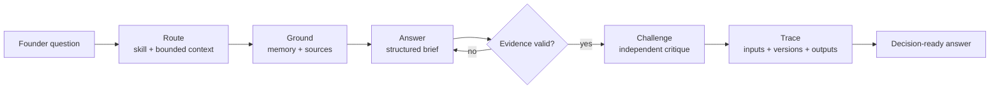
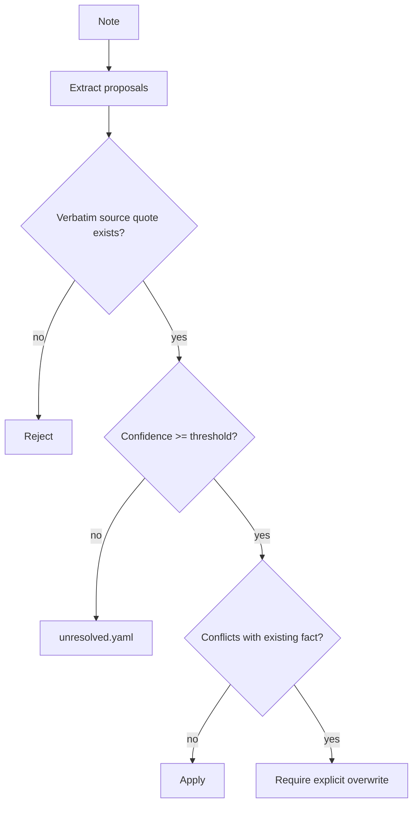

# FounderOS

### I wanted an AI advisor that could disagree with me — and show its work.

**FounderOS is an evidence-driven decision system for founders who would rather be corrected than comforted.**

Most AI advice is polished pattern-matching: it sounds useful, but it usually cannot show which company fact it used, whether a quote is real, what assumptions it made, or where its recommendation breaks.

FounderOS treats founder advice like an engineering problem:

```text
question
  ↓
select bounded company context
  ↓
apply a versioned decision procedure
  ↓
ground claims in verified sources
  ↓
generate a structured answer
  ↓
challenge it independently
  ↓
validate evidence again
  ↓
retain the run as a replayable trace
```

> **Product hypothesis:** FounderOS should improve a founder's judgment compared with giving the same model the same company context in one prompt.

That is intentionally a testable claim, not a slogan.

---

## Why this is a serious project

FounderOS treats model output as an **untrusted boundary**, not a product primitive.

| Property | Concrete mechanism |
| --- | --- |
| **Company context is auditable** | Private startup memory is typed YAML + Markdown. The selected subset is hashed and saved with each run. |
| **Advice follows a procedure** | 9 versioned skills declare required context, output shape, source vocabulary and failure modes. |
| **Source claims have receipts** | Quotes marked as evidence are mechanically located in the fetched corpus during verification. |
| **A confident draft is not final** | A separate challenger critiques the draft; unsupported revisions are rejected. |
| **Paid inference becomes test input** | Raw provider responses can be saved and replayed without credentials. |
| **Missing infrastructure degrades honestly** | No key or unavailable corpus yields a labelled offline mode — never simulated model synthesis. |

This is not multi-agent theatre. The default pipeline is deliberately small: **route → reason → challenge**. Each layer is a measurable intervention that can be removed, replayed and evaluated.

### Evidence snapshot

| 9 versioned skills | 2 expert packs / 16 principles | 12 mechanically verified quotations | 5 frozen startup workspaces | 127 offline tests |
| --- | --- | --- | --- | --- |

These are repository facts, not outcome metrics. FounderOS does **not** claim to beat a frontier model until the blinded evaluation suite proves it.

## What I built

I built FounderOS because I kept noticing the same failure mode in AI advice: the answer could be articulate without being accountable.

The system I wanted had to do more than generate a good response. It had to make the path to that response inspectable.

The parts I focused on most were:

- **bounded context selection** instead of dumping everything into a prompt;
- **versioned skills** that behave like procedures rather than personas;
- **provider-boundary normalization** for malformed structured output;
- **provenance-aware company memory** with explicit quote gates;
- **source verification** so quotations are build artifacts, not decoration;
- **independent challenge** without giving the critic the original reasoning chain;
- **replayable traces** so paid model output can become deterministic regression input;
- **ablation-based evaluation** to test whether each architectural layer earns its complexity;
- **honest degraded modes** instead of pretending unavailable systems ran successfully.

The project is really about one question:

> **Can an AI system be engineered to improve judgment, rather than merely produce persuasive text?**

## Core architecture



The important boundaries are explicit:

```text
startup memory     what is true about this company
knowledge base     what an external source actually says
skills             how a class of decision should be worked
experts            source-grounded principles, not synthetic personas
provider boundary  model-specific weirdness quarantined at the edge
trace              exactly what context, versions and outputs produced a run
```

## Hard engineering problems

### 1. Structured output is not reliably structured

Provider responses can be semantically correct and still fail a schema because of wrappers, double-encoded enums or SDK-specific formatting.

FounderOS contains that mess at the provider boundary:

```text
provider response
      │
      ├─ exact schema parses ───────────────► use it
      └─ schema mismatch
            │
            ├─ unwrap known shallow envelopes
            ├─ decode only valid JSON string literals
            ├─ validate again against the exact Zod schema
            └─ retry once with a precise format correction
```

The rule is conservative: salvage only data that still validates. Do not guess structure from arbitrary prose, and do not retry auth, billing or rate-limit failures as if they were formatting errors.

### 2. AI-assisted memory writes need a quote gate

`context ingest` does not blindly merge model output into company memory.



Every applied entity carries provenance: source, source type, import date and original quote. Low-confidence facts remain unresolved instead of silently entering the source of truth.

### 3. Citations have to survive verification

The shared knowledge layer separates verified quotations from paraphrases whose original source has not been established.

```text
source manifest + SHA-256
           │
           ▼
fetched corpus ──► chunks ──► principles / claims
           │                         │
           └──── quote lookup ◄──────┘
                                      │
question + skill ──► retrieval ──► citable passage IDs
```

A missing source is treated as a visible limit, not an excuse to manufacture authority.

### 4. A challenger can hallucinate too

The challenger receives company context and the draft, but not the hidden reasoning used to generate it.

If its proposed revision cites support that was never retrieved, FounderOS rejects that revision and keeps the already-validated draft.

The critic is useful precisely because it is **not trusted either**.

### 5. Paid runs should become reproducible tests

Every run can retain:

- selected context hash;
- skill and expert versions;
- retrieved passage IDs;
- prompts;
- raw provider outputs;
- timings;
- final result.

A paid run can then become a zero-cost replay fixture that regression-tests routing, context selection, citation validation, challenger handoff and rendering without hitting a provider again.

## Failure-first behavior

| Failure | System response | What it refuses to do |
| --- | --- | --- |
| Malformed structured output | Normalize known shapes, validate, retry once | Guess structure from prose |
| Invented citation | Return validation errors or reject revision | Present unsupported authority |
| Corpus unavailable | Continue with labelled degraded retrieval | Claim semantic grounding happened |
| Low-confidence imported fact | Preserve in `unresolved.yaml` | Merge into company memory |
| Conflict with founder-authored value | Require explicit overwrite | Silently rewrite the source of truth |
| Missing credentials | Produce an honest offline brief | Pretend full reasoning ran |

## The evaluation is part of the product

The architecture is not assumed to be useful just because it is elaborate.

FounderOS is designed as an ablation ladder:


Comparisons are blind and position-randomized. A win over `context-dump` should be attributable to a closed mechanism such as context selection, procedure, expert knowledge, challenge or provenance.

A win over an empty chat is not enough.

The harness also reports losses, ties, cost, latency and broken rungs. If a layer does not earn its complexity, it should be removed.

See [`docs/v0-validation.md`](docs/v0-validation.md) and [`docs/evals.md`](docs/evals.md).

## Two memories, deliberately separate

| | Startup Memory | Knowledge Base |
| --- | --- | --- |
| Purpose | What is true about your company | What an external source actually says |
| Storage | YAML + Markdown | PostgreSQL + pgvector |
| Scope | Private, small, inspectable | Shared, source-grounded, expandable |
| Retrieval | Explicit closed context keys | Lexical + semantic retrieval with RRF |
| Change model | Files you can diff and review | Manifest + deterministic ingest |

Private company context stays easy to inspect and back up. Shared knowledge gets indexing and provenance without becoming a hidden system of record for the startup.

## Try it

Requires Node 22+ and pnpm.

```bash
./scripts/setup.sh
pnpm founderos doctor
pnpm founderos status
pnpm founderos ask "Where should I focus this week?" --offline
```

For a full provider-backed run, configure the required API key and ask normally:

```bash
pnpm founderos ask "Should we raise prices now?" --skill pricing
pnpm founderos ask "How should I prepare for this customer call?" --skill meeting-prep
pnpm founderos ask "Is this ready to ship?" --skill product-review
```

Useful ablations:

```bash
--no-challenge
--no-experts
--no-corpus
--save-run <name>
```

## Verify before you trust it

```bash
pnpm verify
```

Verification includes TypeScript checking, quote verification against the fetched corpus and the offline suite. Recorded provider responses allow core orchestration to be replayed without credentials.

## Repository map

```text
app/                  Next.js interface
src/context.ts        Startup-memory schema + hashing
src/router.ts         Skill/context/expert selection
src/pipeline.ts       Route → ground → reason → challenge → trace
src/provider.ts       Provider boundary + structured-output recovery
src/knowledge/        Corpus, retrieval, embeddings, provenance
src/ingest/           Quote gate, conflict handling, apply flow
src/eval.ts           Ablations, judging, attribution
skills/               Versioned procedures + failure modes
experts/              Versioned expert packs + principle IDs
context/example/      Inspectable starter memory
evals/                Frozen fixtures + behavioral cases
```

## Current limits

- Full reasoning and live context extraction require provider credentials.
- Semantic retrieval requires embeddings; lexical search works without them.
- The first complete judged eval suite has not run, so superiority over `context-dump` remains unproven.
- The shared corpus is strongest for Paul Graham today; additional expert packs are constrained by source availability and the provenance bar.

Those limits are intentional to state explicitly. A system making claims about judgment should be unusually clear about where its evidence ends.

---

**Generate less certainty. Build more accountability.**
